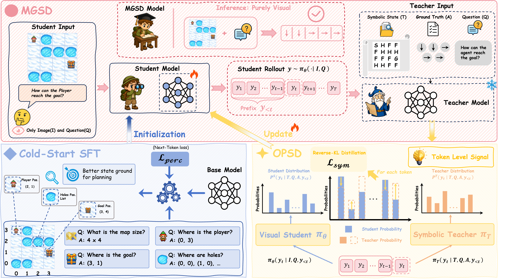

<div align="center">

# Learning Visual Spatial Planning from Symbolic State via Modality-Gap-Aware Self-Distillation


[](https://arxiv.org/pdf/2606.06076)

</div>

MGSD studies how vision-language models perceive structured visual states and
learn to plan over them. It first uses cold-start perception SFT to help the
model recover task state from images, then uses OPCD training where a text-only
teacher guides a visual student.

The code supports three visual spatial planning tasks:

- 🧊 **FrozenLake**: navigate from player to goal while avoiding holes.
- 🧩 **Maze**: recover maze connectivity and plan through open corridors.
- 🖨️ **MiniBehaviour**: pick up the printer object and drop it next to the table.

Datasets and trained checkpoints will be released separately.

## 🚀 Pipeline

<p align="center">
  
</p>

## ✨ Highlights

- **Perception-first cold start**: SFT targets task-state recognition before
  downstream planning.
- **Text-teacher / visual-student OPCD**: the teacher receives symbolic context,
  while the student learns from task images.
- **Task-aware prompts and rewards**: FrozenLake, Maze, and MiniBehaviour each
  use tailored prompts, parsers, and success checks.
- **Unified evaluation**: local checkpoint, perception, API, and modality-gap
  evaluation are collected under one entry point.

## 🗂️ Repository Map

```text
MGSD/
  task_envs/             # task simulators, parsers, renderers, reward utilities
  LlamaFactory/          # cold-start perception SFT pipeline
  EasyR1/                # OPCD training pipeline
  evaluate/              # checkpoint, perception, API, modality-gap evaluation
  api_config_files/      # empty API config templates
  data/                  # local data placeholder
  models/                # local model placeholder
  requirements/          # environment requirement files
```

## 🛠️ Environment Setup

MGSD uses three environments:

| Environment | Purpose | Setup |
| --- | --- | --- |
| `vspsft` | Cold-start perception SFT | `requirements/vspsft.txt` + editable local `LlamaFactory` |
| `easyr1` | OPCD training | follow upstream [EasyR1](https://github.com/hiyouga/EasyR1) |
| `vlmevalkit` | checkpoint/API evaluation | follow upstream [VLMEvalKit](https://github.com/open-compass/VLMEvalKit) |

Example SFT environment:

```bash
conda create -n vspsft python=3.11 -y
conda activate vspsft
pip install -r requirements/vspsft.txt
pip install -e LlamaFactory
```

For EasyR1 and VLMEvalKit, use their official installation guides or containers.
This repository keeps the MGSD task-specific scripts and wrappers.

## 🔍 Cold-Start Perception SFT

After unpacking the released SFT data, train the 4B model:

```bash
bash LlamaFactory/examples/train_lora/qwen3vl_4b_vsp_tasks_perception_sft.sh
```

Train the 8B model:

```bash
bash LlamaFactory/examples/train_lora/qwen3vl_8b_vsp_tasks_perception_sft.sh
```

Common overrides include `MODEL_NAME_OR_PATH`, `OUTPUT_DIR`, `DATASET_DIR`,
`MEDIA_DIR`, `SWANLAB_PROJECT`, and `SWANLAB_RUN_NAME`.

Merge a trained LoRA checkpoint:

```bash
bash LlamaFactory/examples/merge_lora/merge_vsp_tasks_perception_sft.sh \
  LlamaFactory/saves/qwen3-vl-4b/vsp_tasks_perception_lora_sft/checkpoint-828
```

Set `MODEL_SIZE=8b` or `EXPORT_DIR=...` when merging an 8B checkpoint or writing
to a custom destination.

## 🧠 OPCD Training

Prepare mixed OPCD parquet data from the released task data:

```bash
bash EasyR1/examples/prepare_qwen3_vl_4b_vsp_tasks_opcd_data.sh
```

Train 4B:

```bash
bash EasyR1/examples/qwen3_vl_4b_vsp_tasks_opcd_base_teacher.sh
```

Train 8B:

```bash
bash EasyR1/examples/qwen3_vl_8b_vsp_tasks_opcd_base_teacher.sh
```

Common overrides include `MODEL_PATH`, `DATA_ROOT`, `VAL_RAW_ROOT`,
`TRAIN_FILES`, `VAL_FILES`, `PROJECT_NAME`, and `EXPERIMENT_NAME`.

Merge an OPCD checkpoint:

```bash
bash EasyR1/examples/merge_vsp_tasks_opcd_checkpoint.sh \
  EasyR1/checkpoints/VSP_Tasks_OPCD/<experiment>/global_step_<N>
```

By default, the merged Hugging Face checkpoint is written to
`global_step_<N>/actor/huggingface`. Set `EXPORT_DIR=...` to copy it to a custom
checkpoint directory.

## 📊 Evaluation

Evaluation entry points live in [`evaluate/`](evaluate/).

Perception SFT evaluation:

```bash
bash evaluate/perception_eval/vlm.sh
bash evaluate/perception_eval/run_vsp_perception_eval.sh
```

Local checkpoint VisualPlanning evaluation:

```bash
MODEL_PATH=models/ckpts/<your-checkpoint> \
  bash evaluate/ckpt_eval/serve_ckpt_8x.sh

bash evaluate/ckpt_eval/run_ckpt_eval.sh
```

Closed-source or OpenAI-compatible API evaluation:

```bash
export OPENAI_API_KEY=...
export OPENAI_BASE_URL=https://your-endpoint/v1
bash evaluate/api_eval/run_api_eval.sh
```

See [`evaluate/README.md`](evaluate/README.md) for more details.

## 📝 Note

TODO:

- [x] Release the arXiv paper.
- [x] Release the source code.
- [ ] Release VSP-Tasks training and validation data.
- [ ] Release trained SFT and OPCD checkpoints.

## 📚 Citation

If you find MGSD useful for your research, please consider citing our paper:

```bibtex
@misc{luo2026mgsd,
  title = {Learning Visual Spatial Planning from Symbolic State via Modality-Gap-Aware Self-Distillation},
  author = {Luo, Haocheng and Liu, Jiahui and Zhang, Ruicheng and Zhong, Zhizhou
            and Huang, Jiaqi and Xu, Zunnan and Shi, Quan and Zhou, Jun and Li, Xiu},
  year = {2026},
  eprint = {2606.06076},
  archivePrefix = {arXiv}
}
```

Paper: https://arxiv.org/pdf/2606.06076

## 📬 Contact

For questions or discussion, please contact **oranger_wy@163.com**.

## 🙏 Acknowledgements

MGSD builds on several excellent open-source projects:

- [LLaMA Factory](https://github.com/hiyouga/LLaMA-Factory) for efficient
  multimodal SFT.
- [EasyR1](https://github.com/hiyouga/EasyR1) for scalable multimodal RL/OPCD
  training infrastructure.
- [VLMEvalKit](https://github.com/open-compass/VLMEvalKit) for VLM evaluation
  tooling and ecosystem support.

We sincerely thank the authors and contributors of these frameworks.
